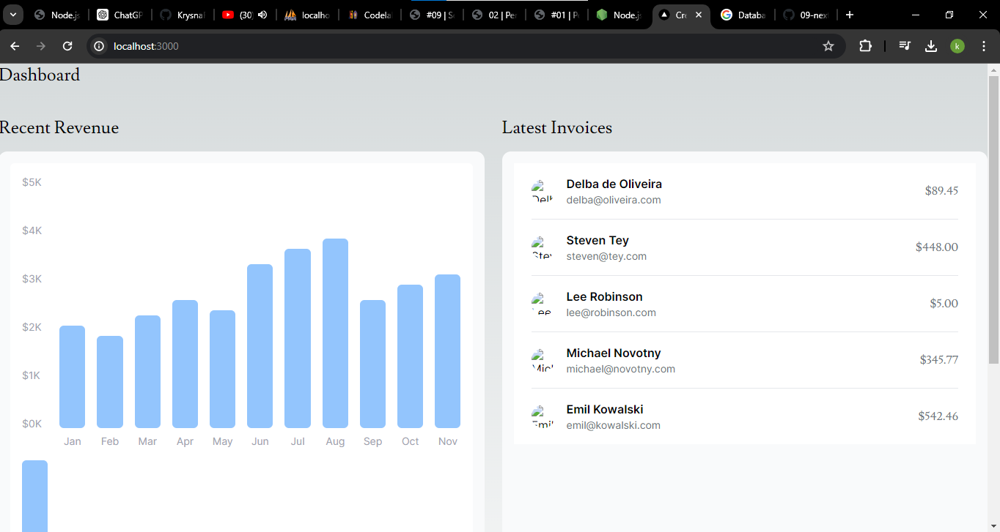
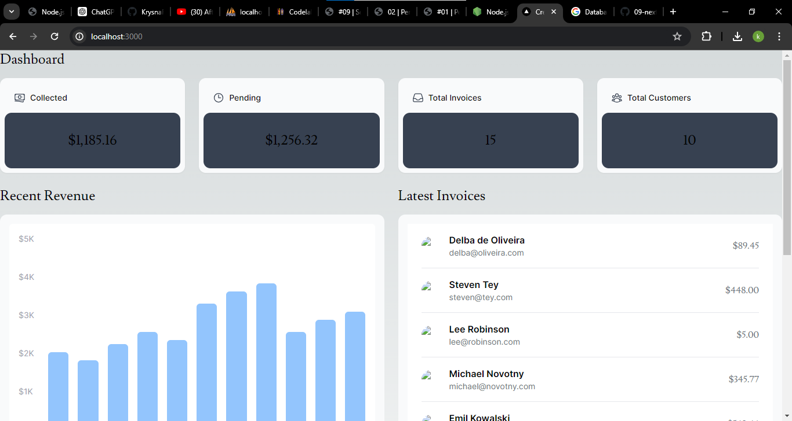

> **Krysna Rachmat Ramadhan Budiono**
>
> 3C / 08
>
> 2141720219


1. 

```
mengkonfigurasikan repository 09-nextjs-database, dengan vercel untuk dideploy
```

2. 

```
file (.env) adalah penghubung database postgres dengan web vercel
```

3. 

```
dengan menggunakan terminal, kita bisa melakukan seed di web vercel
```

4. 

```
Keberhasilan query menunjukkan bahwa proses penanaman telah berhasil dilakukan dengan baik
```

5. 
```
Pertama, mendefinisikan struktur data melalui model untuk setiap tabel. Kemudian, menggunakan model query untuk mengakses data dari database dan memprosesnya sebelum ditampilkan di laman. Selanjutnya, membuat komponen dan laman yang diperlukan, tetapi tunda tampilan data sampai laman dapat dijalankan untuk mencegah error. Setelah komponen selesai, perbarui halaman utama (page.tsx) agar dapat menampilkan komponen yang telah dibuat saat server dijalankan.
```
6. 
```
Menampilkan grafik yang telah dibuat pada file revenue-chart.tsx yang berada di folder moleculs, kemudian memanggil function RevenueChart yang berada pada revenue-chart.tsx di file page.tsx dengan cara dilakukan import
```
7. 
```
Menampilkan semua data yang berada di tabel invoices yang mengambil di database kemudian menampilkannya.
```

###
> Tugas Praktikum
Soal 1 : Jika Anda perhatikan pada file src\app\page.tsx untuk komponen Card sebenarnya telah dibuat sebagai molecules pada file src\app\components\molecules\card.tsx yaitu komponen CardWrapper.

Soal 2 : Perhatikan fungsi fetchCardData() (pada file src\model\query.tsx) dari soal nomor 1. Jelaskan maksud kode dan kueri yang dilakukan dalam fungsi tersebut!
```
const numberOfInvoices = Number(data[0].rows[0].count ?? "0");
const numberOfCustomers = Number(data[1].rows[0].count ?? "0");
const totalPaidInvoices = formatCurrency(data[2].rows[0].paid ?? "0");
const totalPendingInvoices = formatCurrency(data[2].rows[0].pending ?? "0");
```

```
1. Kode didalam numberOfInvoices dan numberOfCustomers digunakan untuk mengambil nilai 'count' dari hasil query pertama yaitu invoiceCountPromise dan dari hasil query kedua yaitu customerCountPromise yang telah dijalankan dan nilai nya nya akan dilakukan konversi tipe datanya menjadi number. Jika nilai 'count' tidak tersedia, maka otomatis akan diberikan nilai default yaitu '0'
2. Kode didalam totalPaidInvoices dan totalPendingInvoices digunakan untuk mengambil nilai 'paid' dari hasil query ketiga yaitu invoicesStatusPromise yang telah dijalankan dan mengambil nilai 'pending' dari hasil query query yang sama, yang kemudian akan dikeonversikan hasilnya ke dalam format angka.
```