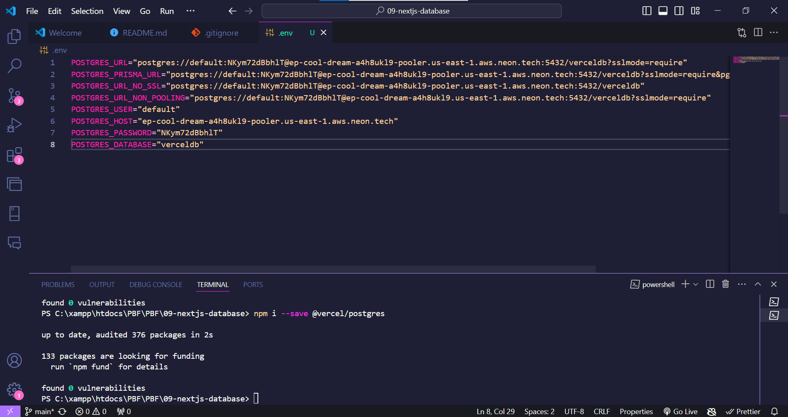
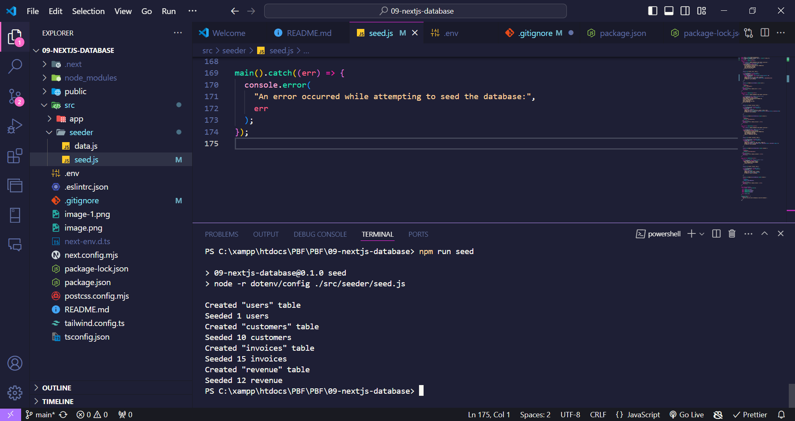
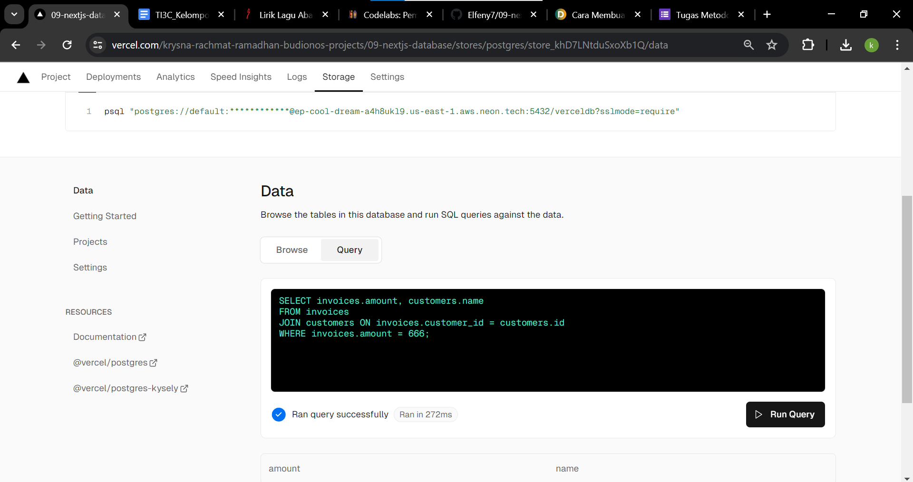
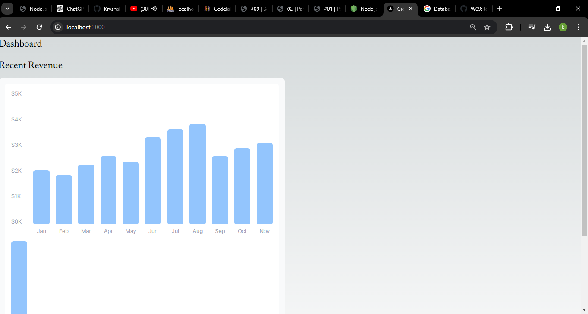

1. 

```
mengkonfigurasikan repository 09-nextjs-database, dengan vercel untuk dideploy
```

2. 

```
file (.env) adalah penghubung database postgres dengan web vercel
```

3. 

```
dengan menggunakan terminal, kita bisa melakukan seed di web vercel
```

4. 

```
Keberhasilan query menunjukkan bahwa proses penanaman telah berhasil dilakukan dengan baik
```

5. 
```
Pertama, mendefinisikan struktur data melalui model untuk setiap tabel. Kemudian, menggunakan model query untuk mengakses data dari database dan memprosesnya sebelum ditampilkan di laman. Selanjutnya, membuat komponen dan laman yang diperlukan, tetapi tunda tampilan data sampai laman dapat dijalankan untuk mencegah error. Setelah komponen selesai, perbarui halaman utama (page.tsx) agar dapat menampilkan komponen yang telah dibuat saat server dijalankan.
```
6. 
```
Menampilkan grafik yang telah dibuat pada file revenue-chart.tsx yang berada di folder moleculs, kemudian memanggil function RevenueChart yang berada pada revenue-chart.tsx di file page.tsx dengan cara dilakukan import
```
